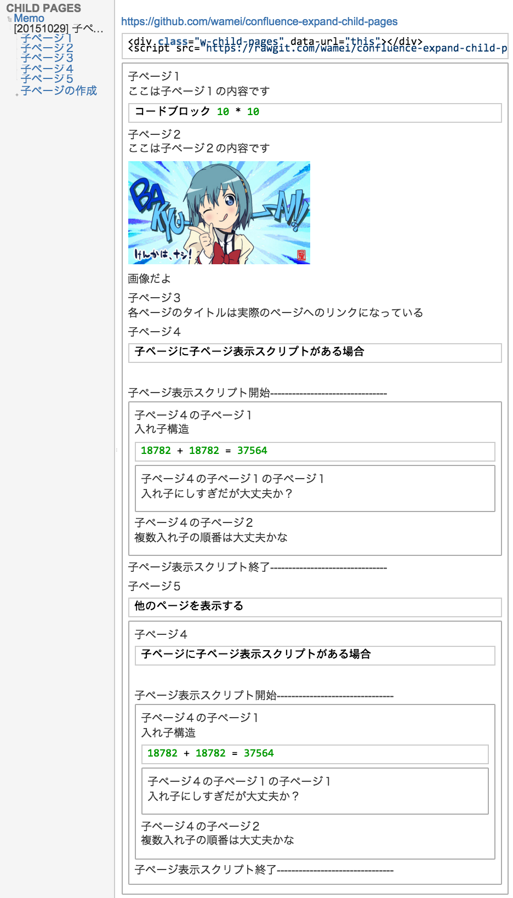

## confluence-expand-child-pages
コンフルーエンスで子ページを中身も含めて展開するマクロ



子ページにマクロが存在すれば再帰的に展開する  
自身の子ページだけでなく任意のページも展開可能  
1ページに複数記述可能

## 使い方

### 1.HTMLマクロを挿入する
その他のマクロの挿入から


こんなやつを選ぶ


### 2.HTMLマクロにコードを書く
任意のページを展開する場合は``data-url``にページのURLを記入する

```
<div class="w-child-pages" data-url="this"></div>
<script src="https://rawgit.com/wamei/confluence-expand-child-pages/master/main.js"></script>
```

### 3.（子ページでコードブロックを利用している場合）
空でもいいのでページのどこかにコードブロックを挿入しておく
